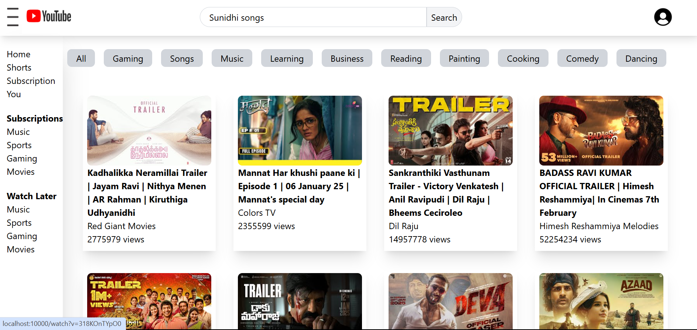
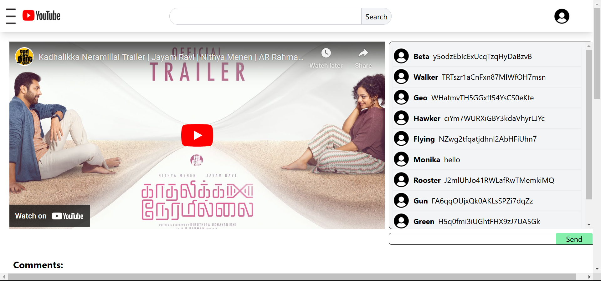
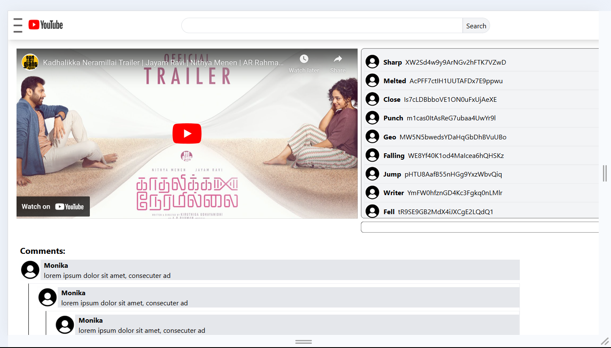

# Youtube clone

Frontend for a YouTube-like application that provides users with video recommendations and seamless video playback functionality. The app integrates and uses the YouTube API for fetching video data, leverages Redux for state management, and includes a comments section with n-level threading and live chat for an engaging user experience.

# Web App link:

https://youtube-0r6c.onrender.com

# Features:

## YouTube API Integration

- Fetches video data for popular, trending, and user-recommended videos.

## Video playback

- Dedicated video page for playback.

- Includes:
  - Dummy Comment Section: N-level threaded comments for discussions.Users can reply comments.
  - Live Chat:
    Real-time chat for engaging with viewers during video playback.

## Sidebar Navigation

- Collapsible menu for better UI/UX.
- Categories like:

  - Home
  - Trending
  - Subscriptions
  - Watch Later

## Search feature

- to search videos based on input
- uses youtube search Api

## State management using Redux

- Efficient state management for: Fetching data from youtube APIs

# Screenshots

- Home Page
  

- Video Player
  

- Comments and Live chat
  

# Technologies used:

List of tools, libraries and frameworks used in the project

- Frontend: React, Redux, Tailwind CSS
- API: Youtube, Search
- Deployment: Render

# Installation

1. Clone the repository
   git clone https://github.com/monikakhanka/youtube.git
2. Navigate to the project directory
   cd youtube
3. Install dependencies
   npm install
4. create .env file with following environment variable and copy the keys from your account:
   REACT_APP_GOOGLE_API_KEY=<Your api key>
5. Start the development server
   npm start dev

## How it works

Steps to use the app:

1. Home page

- Displays clickable video cards
- Burger Menu, which displays a side bar with different options on clicking

2. Search bar

- On typing in the search bar it gives suggestions based on input

3. Video Page

- On clicking the video card of any video a new page opens up
- Play the video by clicking on the video
- This page also has n-level comment secction (Dummy)
- live chat feature can be used to comment on realtime basis
- On clicking the youtube icon or the side bar, can go back to the home page
